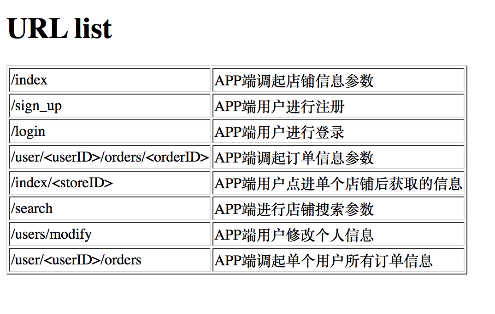

# Flask web app服务

## need install :
1、package socket、flask、pymysql
2、为保证系统安全，建议安装虚拟环境  
```
pip install virtualenv
```
3.新建虚拟环境  

```
virtualenv venv
```

4.激活虚拟环境  

```
source venv/bin/activate       # Linux 下
venv\scripts\activate          # Windows 下
```

# 运行

**注意：** 在运行项目之前需在config.py中配置数据库相关参数

```
DB=pymysql.connect("localhost", "mysqldb", "mysql", "mysqldb")
```

3.管理系统 
运行项目之后访问 [http://0.0.0.0:5000](http://localhost:5000) 可以查看
浏览器：http://172.25.184.53:5003/index?key_id=1
 
## API

>>>>>>> flask_web_service commit
